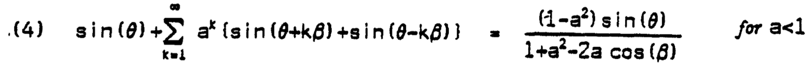
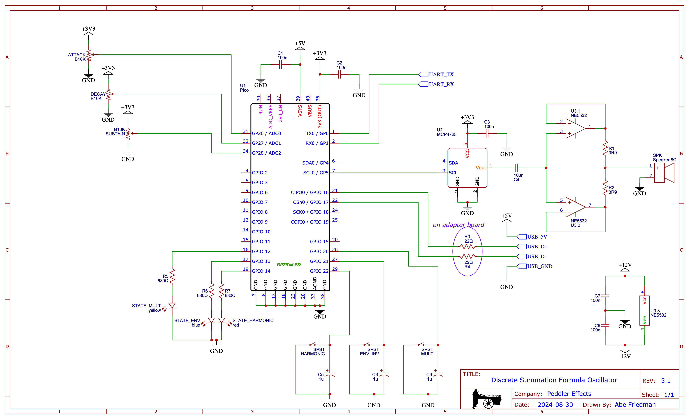

# dsf-oscillator-pico
Digital audio synthesis oscillator based on James A. Moorer's 1975 paper "The Synthesis of Complex Audio Spectra by Means of Discrete Summation Formulae;" coded for Raspberry Pi Pico.

Demo video
===

### Folder Structure
* `DSF-OSCILLATOR-PICO` 
  Library source
  CMakeLists.txt for example program
  * `/inc`
    Header file defining `fix15` type and necessary conversion and arithmetic macros
  * `/example`
    * `/lib`
      * `/MCP4725_PICO`
        DAC library (see "Dependencies" below)
      * `/usb_midi_host`
        USB-MIDI host library (see "Dependencies" below)
    * `/src`
      Example source code
  * `/resources`
    Hardware schematic for example program
    Documentation images

Implementation
===
The `DsfOsc` object generates audio using Equation 4 in Moorer's paper:

To improve speed, the math is implented using fixed-point arithmetic (see `fix15.h` and the detailed explanation in [Hunter Adams' video lecture](https://www.youtube.com/watch?v=shOF17Afznw&t=1710s)) and sine/cosine lookup tables.

Definitions
---
A few constants can be found near the top of `dsf-oscillator-pico.h`:
- `two32`: the value of 2^32, used to calculate the increment values for sine and cosine
- `one15`: fixed-point representation of 1, used to simplify fixed-point calculations
- `two15`: fixed-point representation of 2, used to simplify fixed-point calculations

Although Equation 4 specifies `a < 1`, I found that values close to the boundaries produced harsh sounds and limited my example code to `0.1 < a < 0.9` – but you could try other values by adjusting the values below:
- `param_a_max15`: maximum value for the `a` term used in the synthesis equation 
- `param_a_min15`: minimum value for the `a` term used in the synthesis equation 
- `param_a_range`: difference between `param_a_max15` and `param_a_min15`, useful for calculating envelope timing. Calculated based on the max/min values.

I also have not tried negative values but the `fix15` type is signed so you could see what happens.

Methods
---
### DsfOsc(uint16_t sample_rate, uint8_t dac_bit_depth)
The constructor takes care of a number of housekeeping/setup items:
1. Store the sample rate and DAC bit depth for use later on
2. Because the audio algorithm returns a value between `-1 < x < 1` and the DAC needs a value between `0 < x < ((2 ^ dac_bit_depth) -1)`, we calculate 1/2 of the maximum DAC value to use in scaling the output value properly.
3. The constuctor performs a one-time conversion of the sine and cosine lookup tables from `float` to `fix15`.

* `sample_rate`: The audio sample rate in Hz
* `dac_bit_depth`: The DAC bit depth

### uint16_t getNextSample(fix15 param_a)
This method returns the next sample and should be called repeatedly from a timer whose period is `1,000,000  / sample_rate` (i.e., the timer interval  in microseconds).

* `param_a`: Fixed-point representation of the `a` term in the synthesis equation. This method checks the condition `param_a_min15 < param_a < param_a_max15` and limits out-of-bounds values to stay within the specified range.

`getNextSample` returns an unsigned 16-bit value within the initialized DAC range, which can be passed directly to the DAC.

### void freqs(fix15 freqNote, fix15 freqMod, bool reset = true)
This method sets the carrier and modulator frequencies. By default, it also resets the sine and cosine counters to zero; pass a `false` value for `reset` to override this behavior.

* `freqNote`: fixed-point carrier frequency in Hz
* `freqMod`: fixed-point modulator frequency in Hz
* `reset`: if `true`, resets sine and cosine counters to zero

### void freqs(fix15 freqMod, bool reset = false)
This overload allows you to alter the modulator frequency without changing the carrier frequency. By default, it **does not** reset the sine and cosine counters; pass a `true` value for `reset` to override this behavior.

* `freqMod`: fixed-point modulator frequency in Hz
* `reset`: if `true`, resets sine and cosine counters to zero. **N.B.: passing a `true` value for `reset` will reset BOTH counters.**

### void resetCount()
This method resets both sine and cosine counters.

Example Program
===
The example code implements monophonic oscillator with a built-in ADS envelope (I'm sure I could have worked out how to get R into that envelope but I didn't feel like working so hard for it) and support for USB-MIDI controllers.

Hardware Setup
---
[Click here for PDF Schematic](resources/dsf-example-schematic-3.1.pdf)

The hardware uses three push buttons and three potentiometers for input, as well as relying on USB-MIDI for note input. Output goes through an MCP4725 12-bit i2c DAC, with two op amps in parallel driving a speaker. The schematic also shows hookups for indicator lights showing the state of the three `bool` flags controlled by the push buttons, with a key to the indicator colors shown in the [demo video](**need link for when that's done**).

Example Code
---
### Dependencies
* [MCP4725_PICO](https://github.com/gavinlyonsrepo/MCP4725_PICO) to control the DAC. Place in `./example/lib/MCP4725_PICO`
* [usb_midi_host](https://github.com/rppicomidi/usb_midi_host) for MIDI input. Place in `./example/lib/usb_midi_host` and copy `tusb_config.h` into `./example/`

### Data Structures and Definitions
* `VERBOSE`: if true, program will output note status and debugging messages via UART serial
* `SAMPLE_RATE`: audio sample rate in Hz
* `SAMPLE_INTERVAL`: timer callback interval in µs, calculated based on sample rate
* `DAC_BIT_DEPTH`: DAC bit depth
* `I2C_SPEED`: i2c bus speed in kHz, passed to MCP4725 constructor

#### ADS Envelope
* `ENV_TIME_MIN`: minimum Attack/Decay time in milliseconds
* `ENV_TIME_MAX`: maximum Attack/Decay time in milliseconds 
* `envelope_mode_t`: enumeration of envelope modes, includes `release` in case anyone wants to implement that functionality :>
* `envStep`: constant representing the step size – could be anything, but 0.001 makes it easy to convert microsecond timekeeping into millisecond envelope durations.
* `envRangeMin`, `envRangeMax`: integer values representing how many sample timer cycles to wait before incrementing/decrementing envelope. Value is calculated by scaling `ENV_TIME_x` by `param_a_range` and then dividing by `SAMPLE_INTERVAL` (i.e., the length between each timer call). We need to use integer values (not `fix15`) to ensure these constants work with `uscale()` (see below), and rounding errors could give us approx. +/-20ms margin of error on envelope length. The default values for `ENV_TIME_MIN`, `ENV_TIME_MAX`, and `param_a_range` result in clean integer values for `envRangeMin` and `envRangeMax`, but a change in any of those three values may introduce some error.
* `envInvert`: Within the envelope "Attack" indicates that `param_a` is incrementing and "Decay" indicates that it is decrementing, but the output may sound backward depending on other settings – sometimes sounding like it is "opening" during the attack phase and "closing" during the decay phase, sometimes vice versa. 
        
To me it sounds like the envelope "changes direction" depending on whether the modulator frequency is above or below the carrier frequency. **It's all rock 'n' roll so whatever sounds "good" to you** – I added this parameter so the user could easily invert the envelope if they want to change the envelope's apparent direction.

#### MIDI & Notes
* `midi_note_t`: struct holding MIDI note data and a `bool` flag indicating whether the note is currently active
* `midiFreq_Hz`: array of floating-point MIDI note frequencies in Hz
* `midiFreq15`: fixed-point array that gets filled during setup with fixed-point MIDI note frequencies in Hz
* `modFactor15`: two-element array for easy access to modulator multipliers 0.5 and 2
* `root2`: fixed point representation of sqrt(2), used for inharmonic modulator frequencies
* `isHarmonic`: state variable for whether we want harmonic or inharmonic output. When this is `false`, the modulator frequency is multiplied by `root2` to get an inharmonic tone.
* `multState`: state variable that determines the relationship of carrier and modulator frequencies: half when `false`, double when `true`. There's no real restriction on how you determine carrier vs modulator frequency (and apparently no requirement that there be any fixed relationship between the two). I picked these two values because they consistently produced musically usable tones across a wide octave range. You could substitute any other two numbers for `modFactor15` and get different results without changing the functional code.

Functions
--- 
### `void setup()`
Basic setup functionality like initializing pins, filling the `midiFreq15` array, etc.

### `bool timerSample_cb(repeating_timer_t *rt)`
Timer interrupt callback function. Does nothing unless we have an active MIDI note. When active, it follows these steps:
1. Read `sustain` value from potentiometer (will always be between `param_a_min15` and `param_a_max15`)
2. Determine which envelope mode we are in
  1. Attack
    1. Read `attack` time from potentiometer
    2. See if we've had enough cycles to increment, and if so increment the envelope
    3. Check if we have hit or exceeded `param_a_max15`. If we have, switch to Decay and reset the counter 
    4. Check if the envelope is inverted or not, and calculate out the right `param_a` value 
  2. Decay
    1. Read `decay` time from potentiometer
    2. See if we've had enough cycles to increment, and if so increment the envelope
    3. Check if we have hit or gone below the `sustain` value. If we have, switch to Sustain and reset the counter 
    4. Check if the envelope is inverted or not, and calculate out the right `param_a` value 
  3. Sustain: Check if the envelope is inverted or not, and calculate out the right `param_a` value 
2. Pass the newly calculated `param_a` to the oscillator and store the returned sample value
3. Send the sample value to the DAC

I added some error checking for out-of-bound DAC values but at this point I am fairly confident that the oscillator can't return an invalid value and you could probably just pass send the return value from `osc.getNextSample()` directly to the DAC.

### `void buttons_cb(uint gpio, uint32_t event_mask)`
Button interrupt callback function.

### `void blinkLED(uint8_t count)`
Blinks onboard LED the number of times specified by `count`; if `count == 0` it will blink faster and loop forever, used to signal an error in DAC initialization.

### `uint32_t uscale(uint32_t x, uint32_t in_min, uint32_t in_max, uint32_t out_min, uint32_t out_max)`
Adapted from the Arduino `map()` function, takes an input with a given range `in_max - in_min` and returns a number scaled to `out_max - out_min`.

### `void tuh_midi_rx_cb(uint8_t dev_addr, uint32_t num_packets)`
Adapted from the `usb_midi_host` demo code. Every time a new MIDI event is received, this callback function:
1. Reads MIDI data into `thisNote` (*n.b.: I think it will always store the first incoming event into `thisNote`, but I don't really have a good way to verify this hypothesis*). The first (command) byte is masked so that the channel information is discarded (`usb_midi_host` only allows for one device connection so it doesn't make a difference here).
2. Checks the MIDI command for a "Note On" (0x9x) or "Note Off" (0x8x) message. (CC and Program Change messages are not implemented here, but it would be a simple matter to add `case 0x??:` statements to the `switch` block and implement these as well). If it finds a note message:
  1. Note On
    1. Copy `thisNote` into `lastNote` – we will need this later on
    2. Set `thisNote.active = true` 
    3. Set envelope mode to Attack and reset envelope and counter to 0
    4. Calculate a modulator frequency based on the MIDI note, multiplier, and `isHarmonic`
    5. Call `osc.freqs()` setting the carrier frequency to the MIDI note, passing the calculated modulator frequency, and setting the `reset` flag to `false` so we don't retrigger the sine/cosine tables when changing frequencies in case we're moving from one note directly to another.
    6. Light the onboard LED to show that a note is active (this was helpful in debugging situations where there was no audio)
  2. Note Off
    1. Checks to see if `thisNote.note` matches `lastNote.note` – if not, we do nothing because whatever key was released is not the note currently playing. This is done so that if you hold a second note before releasing the first, releasing the first key will not interrupt the synthesis. **This implementation is monophonic and will always play the most recent note. It does not "remember" earlier notes so all sound stops when you release the most recent key, even if you are still holding an earlier key.**
    2. If the notes match, then we mean to stop playing so `thisNote.active` is set false and the onboard LED turns off. 

### usb_midi_host standard methods
#### `void core1_main()`
#### `void tuh_midi_mount_cb(uint8_t dev_addr, uint8_t in_ep, uint8_t out_ep, uint8_t num_cables_rx, uint16_t num_cables_tx)`
#### `void tuh_midi_umount_cb(uint8_t dev_addr, uint8_t instance)`
#### `void tuh_midi_tx_cb(uint8_t dev_addr)`
These functions are copied without changes from the `usb_midi_host` demo code. See documentation there.
